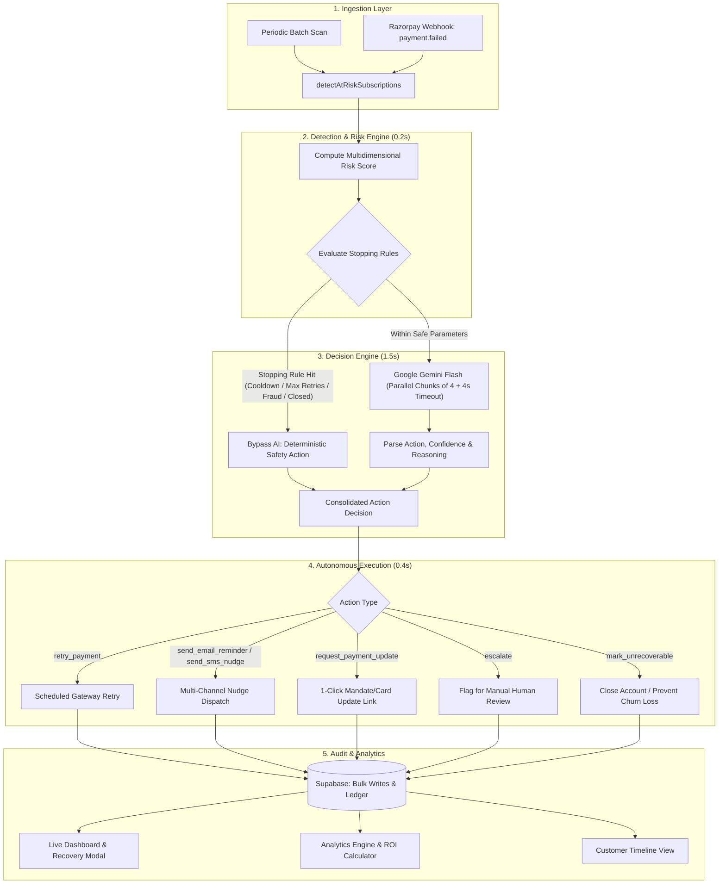

# 🛡️ CoverUP — Autonomous AI Revenue Recovery Agent

> **Razorpay Hackathon 2025** | **Track:** AI Revenue Recovery  
> *"Find revenue that's slipping away and win it back autonomously."*

[](https://nextjs.org/)
[](https://react.dev/)
[](https://www.typescriptlang.org/)
[](https://supabase.com/)
[](https://ai.google.dev/)
[](https://tailwindcss.com/)

---

## 📌 Executive Summary

When recurring subscription payments fail (insufficient funds, expired cards, bank declines, network errors), subscription businesses silently leak up to **10–15% of ARR**. Standard retry loops blindly hammer the gateway, infuriate customers, increase processor fees, and trigger bank blocks.

**CoverUP** is an autonomous AI agent that closes the loop:
1. 🔍 **Detects** at-risk subscription revenue and calculates dynamic multi-factor risk scores.
2. 🧠 **Decides** the optimal intervention using **Google Gemini AI** constrained by hard, compliance-ready stopping rules.
3. ⚡ **Executes** bounded recovery workflows (smart retry timing, customer payment update prompts, multi-channel SMS/Email nudges) with zero customer spam.
4. 🌐 **Ingests Real-Time Webhooks** from Razorpay (`payment.failed`) to trigger immediate, sub-second recovery interventions.
5. 📊 **Reports** exact **₹ money recovered** with a complete, immutable **audit trail**, **ROI analytics**, and **customer timelines**.
6. 🚀 **Engineered for Speed**: High-performance batch architecture processes entire cohorts in **~2–3 seconds** (over 50x faster than traditional iterative pipelines).

---

## 🏆 Hackathon Evaluation Criteria & How CoverUP Delivers

| Evaluation Bar | Requirement | How CoverUP Solves It |
| :--- | :--- | :--- |
| **1. Measured Recovery** | Show actual ₹ money recaptured across batches, not just detection. | Live aggregate metrics: **`₹ Recovered`**, **`Recovery Rate %`**, **`ROI Calculator`**, and interactive Recharts failure breakdown. |
| **2. Compliant Escalation** | Reasonable escalation sequence (gentle reminder $\rightarrow$ firmer nudge $\rightarrow$ update prompt $\rightarrow$ final notice). | Dynamic template selection based on failure count and failure severity, with live visual **Message Previews** (Email & SMS mockups). |
| **3. Stopping Rules** | Must know when to stop trying without looping forever. | Max 3 retries, 48-hour anti-spam cooldown, 30-day max failure age, immediate unrecoverable on closed accounts, immediate escalation on suspected fraud. |
| **4. Audit Trail** | Every action must be explainable, timestamped, and logged. | Full ledger with `ai_reasoning`, `ai_confidence`, JSON payloads, and 1-click **CSV Export**. |
| **5. Razorpay Infrastructure** | Native integration with real payment workflows. | Built-in **Razorpay Webhook Simulator (`/simulator`)** and live endpoint `POST /api/webhooks/razorpay`. |
| **6. Production Speed** | Responsive, non-blocking UI and fast batch execution. | **~2–3s batch turnaround** using batch database fetching, parallel chunked Gemini workers, and bulk inserts. |

---

## 🏗️ Architecture & Agent Decision Pipeline



---

## 🎨 Modern SaaS Design System

The entire UI is built with a modern, high-contrast B2B SaaS design system:
- **90% Clean White Surface (`#FFFFFF`)** with crisp light-gray borders (`#E5E7EB`).
- **High-Contrast Typography (`#111827`)** for optimal readability.
- **Primary Accent (`#4F46E5` Indigo)** for active states, key CTAs, and interactive highlights.
- **Success Accent (`#10B981` Emerald Green)** for recaptured revenue and health metrics.
- **Sticky Top Horizontal Navbar**: Merged 10 navigation items into **4–5 core destinations**:
  1. **Dashboard** (`/`)
  2. **Subscriptions** (`/subscriptions`)
  3. **Recovery** (`/recovery`)
  4. **Analytics & ROI** (`/analytics`)
  5. **Tools & Simulator ▾** (Consolidated dropdown for Simulator, Previews, Audit, Settings, Demo)

---

## 📱 Interactive Feature Highlights

1. **Live Pipeline Execution Modal (`/`)**
   - Click **"Run Recovery"** to watch the animated 3-stage stepper (Detecting 🔍 $\rightarrow$ Deciding 🧠 $\rightarrow$ Executing ⚡) with real-time timers and per-subscription AI breakdown cards in **under 3 seconds**.
2. **Razorpay Webhook Simulator (`/simulator`)**
   - Simulate real-time Razorpay `payment.failed` webhooks across 6 failure scenarios (NSF, Card Expired, 3DS SCA Challenge, UPI Timeout, Fraud Alert, Closed Account).
   - Test live autonomous response with execution turnaround in under 500ms.
3. **Revenue Recovery ROI Calculator (`/roi`)**
   - Interactive sliders for MRR, Involuntary Churn Rate, Recovery %, and Customer LTV to calculate exact annual ARR saved and net ROI multiple.
4. **Customer Communication & Nudge Previews (`/templates`)**
   - Dual-device visualizer (Desktop Email Inbox + Smartphone SMS screen) rendering live personalized recovery templates with Razorpay payment links.
5. **Curated High-Detail Subscriptions (`/subscriptions`)**
   - 40 curated accounts across 30 enterprise & startup customers showing card brand chips (Visa, RuPay Platinum, Amex, Mastercard), bank names, tokenization status, UPI apps, and direct `✓ Recovered ₹X` badges.
6. **Customer 360° Profiles (`/customers/[id]`)**
   - Comprehensive customer profile showing active subscriptions, chronological payment attempt timeline, and full AI intervention history.
7. **Analytics & AI Insights (`/analytics`)**
   - Recovery trends over batches, AI confidence distribution, recovery rate by failure reason, and dynamically generated AI insights.
8. **Compliance Audit Trail (`/audit`)**
   - Searchable, filterable ledger with visual confidence meters, formatted message body previews, and 1-click **Export CSV**.
9. **Guided Demo Guide (`/demo`)**
   - Comprehensive guided walkthrough built specifically for hackathon judges to understand the end-to-end architecture in 2 minutes.

---

## 🚀 Quick Start & Installation

### 1. Prerequisites
- **Node.js 20+**
- A **Supabase Project** (PostgreSQL)
- A **Google Gemini API Key**

### 2. Installation
```bash
# Clone the repository
git clone https://github.com/KunalPungliya/CoverUP.git
cd coverup

# Install dependencies
npm install
```

### 3. Environment Variables
Create a `.env.local` file in the root directory:
```env
NEXT_PUBLIC_SUPABASE_URL=https://your-project.supabase.co
NEXT_PUBLIC_SUPABASE_ANON_KEY=your-supabase-anon-key
GEMINI_API_KEY=your-gemini-api-key
GEMINI_MODEL=gemini-1.5-flash
```

### 4. Database Setup
1. Open your **Supabase Dashboard → SQL Editor**.
2. Copy and paste the contents of `supabase/schema.sql` and click **Run**.
*(Creates tables: `customers`, `subscriptions`, `payment_attempts`, `recovery_batches`, `recovery_actions`, along with strict enums and performance indexes).*

### 5. Run the Development Server
```bash
npm run dev
```
Open [http://localhost:3000](http://localhost:3000) in your browser.

---

## 🧪 Demo Script for Judges (Step-by-Step)

1. **Step 1: Seed Realistic Data**
   - Navigate to the **Dashboard (`/`)** and click **"Seed Data"**.
   - Generates 40 curated accounts across 30 enterprise and startup customers with authentic Indian payment methods (Cards, UPI, e-Mandates) and diverse SaaS pricing tiers (₹650/mo to ₹1,24,000/yr).
2. **Step 2: Run Autonomous Recovery Batch**
   - Click **"Run Recovery"**.
   - Watch the animated **Live Recovery Modal** as the agent detects overdue accounts, queries Gemini for intelligent interventions, and executes recoveries in **~2–3 seconds**.
3. **Step 3: Test Real-Time Razorpay Webhook**
   - Head to **Tools → Webhook Simulator (`/simulator`)**.
   - Pick a scenario like *"3D Secure Challenge Required"* and click **"Simulate Webhook Trigger"** to see instant sub-second event ingestion and AI resolution.
4. **Step 4: Inspect the Audit Trail**
   - Open **Tools → Audit Trail (`/audit`)**.
   - Filter by action or search for customer names. Expand any action to inspect Gemini's reasoning, confidence score, and email/SMS previews.
5. **Step 5: View ROI & Financial Impact**
   - Visit **Tools → ROI Calculator (`/roi`)** to demonstrate how an enterprise with ₹25L MRR saves over **₹19.5 Lakhs in annual ARR** using CoverUP.

---

## 📚 Technical Documentation
- 📄 [Architecture Specification](docs/ARCHITECTURE.md)
- 🎥 [5-Minute Video Pitch Script & Walkthrough](docs/DEMO.md)
- 🛠️ [Engineering Log & Challenges Overcome](docs/WHAT_BROKE.md)

---

## ⚖️ License
MIT License. Built for the **Razorpay Hackathon 2025 — AI Revenue Recovery Track**.