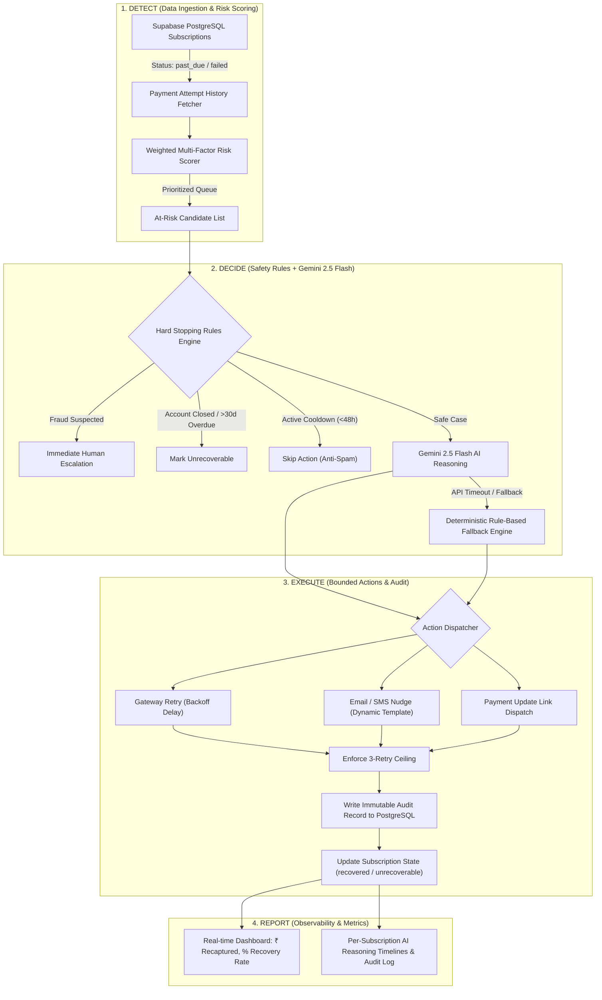

# CoverUP — System Architecture & Technical Specifications

> **Track:** AI Revenue Recovery (Razorpay Hackathon)  
> **Core Mission:** Autonomous end-to-end detection, diagnosis, intervention, and execution for failed subscription payments with compliant escalation and auditable stopping rules.

---

## 1. High-Level Architecture

CoverUP operates on a **4-stage decoupled pipeline** that transitions subscription recovery from manual human chasing to an intelligent, automated feedback loop.



---

## 2. The 3-Stage Pipeline Breakdown

### **Stage 1: Detect (Input & Risk Scoring Layer)**
* **Target Identification:** Queries subscriptions where `status IN ('past_due', 'failed')`.
* **Telemetry Aggregation:** Pulls complete historical failure attempts, payment gateway decline codes, and days overdue.
* **Dynamic Risk Scoring Algorithm:**
  $$\text{Risk Score} = \text{Amount Factor } (0\text{--}10) + \text{Days Factor } (0\text{--}5) + \text{Failure Count } (0\text{--}5) + \text{Severity Weight } (1\text{--}8)$$
  * *Severity Weights:* Fraud (`8`), Closed Account (`7`), Expired Card (`5`), SCA / 3DS Required (`4`), Bank Decline (`3`), Insufficient Funds (`2`), Network Error (`1`).
  * *Sorting:* Higher scores are prioritized for immediate intervention.

---

### **Stage 2: Decide (Safety Guardrails + AI Specialist)**
Before invoking the LLM, the system applies **deterministic stopping rules** to protect customer experience and fraud vectors:

1. **Immediate Fraud Isolation:** If `failure_reason = 'fraud_suspected'`, automated retries are permanently blocked; case escalates to human review.
2. **Account Closure Guardrail:** If `failure_reason = 'account_closed'`, subscription is marked unrecoverable immediately.
3. **Anti-Spam Cooldown:** If an outreach or retry occurred $< 48\text{ hours}$ ago, action is skipped to avoid flooding the user.
4. **Aging Threshold:** If days since first failure $> 30\text{ days}$, marked unrecoverable.

**LLM Reasoning Contract (Gemini 2.5 Flash):**
When eligible, the AI specialist receives full context (plan, amount, failure timeline, past interactions) and outputs structured JSON:
```json
{
  "action": "retry_payment | send_email_reminder | send_sms_nudge | request_payment_update | escalate | mark_unrecoverable",
  "reasoning": "Detailed, human-readable justification for this specific intervention",
  "confidence": 0.85,
  "retry_delay_hours": 72,
  "escalation_note": null,
  "message_template": "gentle_reminder"
}
```

* **Fallback Engine:** If Gemini API is unreachable or rate-limited, an integrated deterministic engine takes over without disrupting execution.

---

### **Stage 3: Execute (Action Simulation & Audit Ledger)**
* **Bounded Retries:** Enforces a hard ceiling of **3 maximum retries** before forcing human escalation.
* **Realistic Outcome Simulation:**
  * Network Timeout $\rightarrow 85\%$ success on retry.
  * Insufficient Funds $\rightarrow 40\%$ success after scheduled delay.
  * Customer Nudges (Email / SMS) $\rightarrow 25\text{--}35\%$ response rate leading to recovery.
* **Audit Trail Insertion:** Every action writes to `recovery_actions` with:
  * Timestamp & Subscription ID
  * Batch ID
  * Action Type & Channel Payload (rendered template text, headers)
  * AI Reasoning & Confidence score
  * Outcome & Amount Recaptured (in paise)

---

## 3. Database Schema

Built on PostgreSQL (Supabase):

```
┌─────────────────┐       ┌──────────────────────┐       ┌──────────────────────┐
│   customers     │───1:N─│    subscriptions     │───1:N─│   payment_attempts   │
│-----------------│       │----------------------│       │----------------------│
│ id (PK)         │       │ id (PK)              │       │ id (PK)              │
│ name, email     │       │ customer_id (FK)     │       │ subscription_id (FK) │
│ phone           │       │ plan_name, amount    │       │ amount, status       │
│ created_at      │       │ status, billing_cycle│       │ failure_reason       │
└─────────────────┘       │ payment_method       │       │ gateway_response     │
                          └──────────┬───────────┘       └──────────────────────┘
                                     │ 1:N
                                     ▼
                          ┌──────────────────────┐       ┌──────────────────────┐
                          │   recovery_actions   │───N:1─│   recovery_batches   │
                          │----------------------│       │----------------------│
                          │ id (PK)              │       │ id (PK)              │
                          │ subscription_id (FK) │       │ started_at           │
                          │ batch_id (FK)        │       │ completed_at         │
                          │ action_type, outcome │       │ total_at_risk        │
                          │ ai_reasoning         │       │ total_recovered      │
                          │ ai_confidence        │       │ total_unresolved     │
                          │ amount_recovered     │       │ total_amount_at_risk │
                          │ retry_count          │       │ total_amount_recov   │
                          └──────────────────────┘       └──────────────────────┘
```

---

## 4. Compliance & Escalation Policy

| Attempt Stage | Intervention Type | Channel | Tone / Policy |
| :--- | :--- | :--- | :--- |
| **Attempt 1** (Transient / Soft Decline) | Intelligent Retry or Gentle Reminder | Email | Helpful, non-alarming heads-up; no service disruption. |
| **Attempt 2** (Persistent Failure) | Urgent Nudge / SMS | SMS / Email | Clear warning of impending service interruption. |
| **Payment Method Invalid** | Payment Update Prompt | Email + Secure Link | Direct tokenized link for self-serve card/UPI update. |
| **Attempt 3** (Final Attempt) | Final Notice | SMS + Email | 48-hour deadline before cancellation. |
| **Attempt > 3 or Fraud** | Human Escalation | Internal Queue | Automated bots halt; human recovery agent review. |

---

## 5. Security & Privacy
* **Data Sanitization:** Payment methods store only tokenized identifiers (card brand, last 4 digits, UPI handles).
* **Idempotency:** Batch runs check action timestamps to avoid re-triggering actions during active cooldown windows.
* **Zero Secret Leakage:** API credentials are environment-scoped (`.env.local`).
